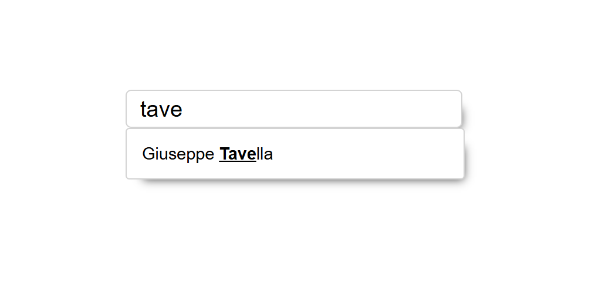

## Remote Search

Search for data at a remote url as the user types in, update the UI and customize how you process data - in a few lines of code, so you can focus on your app's core logic. 

This library is in Vanilla JavaScript.

### Live demo

If you want to see in action first, and then dive in the docs, you can find a [live demo here](https://remote-search.vercel.app/).



### The problem

In a company I worked for, I was often asked to search customers and contracts in their database.

This would be accomplished with a "simple" UI component that, as the user typed in, would automatically populate itself with result items.

"Simple" you say? There are so many details that go into it, to make a professional solution I mean, not just duck-taping some code from stackoverflow, hoping it works.

So, after many tries, I finally decided to create my own remote search library, in Vanilla Javascript.

## Installation

The library is provided via CDN by Cloudflare.

There are two files to include in your project: the CSS and the JS.

### CDN

JavaScipt
```
https://remote-search.giutav.workers.dev/script.js
```

CSS
```
https://remote-search.giutav.workers.dev/style.css
```


### HTML

JavaScipt
```html
<script src="https://remote-search.giutav.workers.dev/script.js"></script>
```

CSS
```html
<link rel="stylesheet" href="https://remote-search.giutav.workers.dev/style.css"/>
```


### Configuration

Remote Search can be configured to fit the app's needs.

```js

// USAGE: working example

new RemoteSearch({
  // where the user types
  inputSelector: "#box1.remote-search-box > .input-box > input",
  // where results are shown
  // listSelector: ".box-search > .list",
  // min char number to trigger remote search
  minLen: 3,
  // url to make request to
  absoluteUrl: "https://mockup-db.giutav.workers.dev/people",
  // when user clicks the individual result item
  onClickItem: (item) => {
    console.log("clicked item", item);
  },
  // when the result is received from the server, return the actual items (list of objects)
  getItemsFromResult: (responseData) => {
    // in this case, the items are found exactly in the json itself,
    // so there's no need to search any further
    // if instead the items are found in the json.items property, you must
    // specify that here with return json.items
    return responseData.items;
  },
  // when the results arrive to the client, from the server
  onGetResults: async (responseData, responseObj) => {
    console.log("results arrived", responseData, responseObj);
  },
  // the property that will be displayed to the user in the result item
  // itemLabel: "name",
  // you can customize the item label. this function will be called
  // for each item, passing in the item. you can then set custom logic
  // to display whichever label you want. if this function is not provided,
  // the instance.itemLabel will be used
  setCustomItemLabel: (item) => {
    return item.firstname + " " + item.lastname;
  },
  // visually mark/highlight the matching search text, in whatever the final item label will be?
  highlightMatch: true,
  // the search term query string parameter that will contain the value of the input
  searchQueryParam: "q",
  // the query params to append to url before making request
  urlQueryParams: {
    // myParam: "some value",
  },
  // the input placeholder, which can be dynamic as well
  // inputPlaceholder: "Search this field",
  // when the focus is lost on the search input, hide the result list?
  onLoseFocusHideResultList: false,
  // custom function to programmatically position the spinner wherever you want,
  // using as reference point the search input
  // positionSpinner: () => {
  //   return {
  //     top: -25,
  //     left: 270,
  //   };
  // },
  // positionResultList: () => {
  //   return {
  //     top: 0,
  //     left: 0,
  //   };
  // },
  // in case no results are found, what to do
  onNoResultFound: () => {
    console.log("no results found");
  },
});

/**
 * Async versione of setTimeout
 */
// const setTimeoutAsync = (fn, delay=0) => {
//     return new Promise(resolve => setTimeout(() => {
//         fn();
//         resolve();
//     }, delay));
// };

// async function main () {
//     await doSomethingAsync()
//     console.log("done")
// }

// main()

// async function doSomethingAsync() {
//     await setTimeoutAsync(() => {
//         console.log("doing something")
//     }, 2000)
// }

```